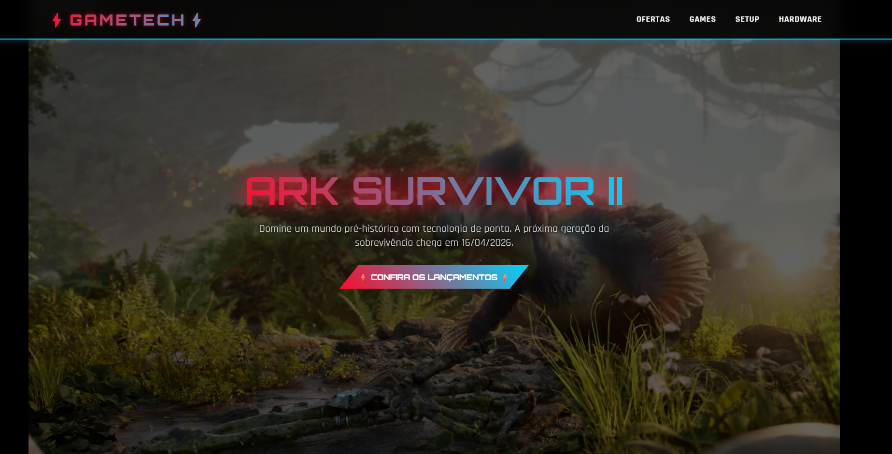
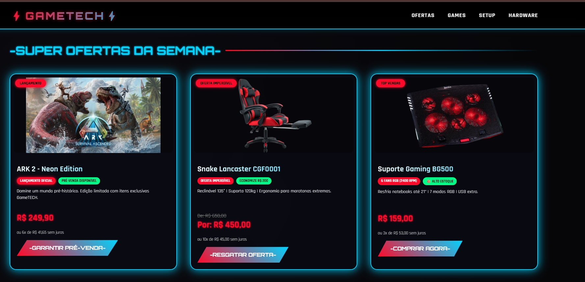
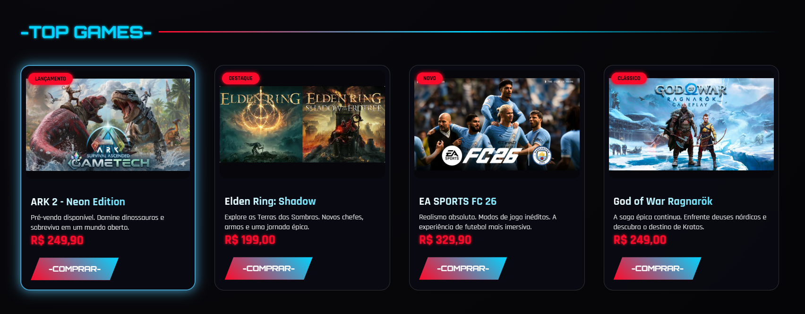
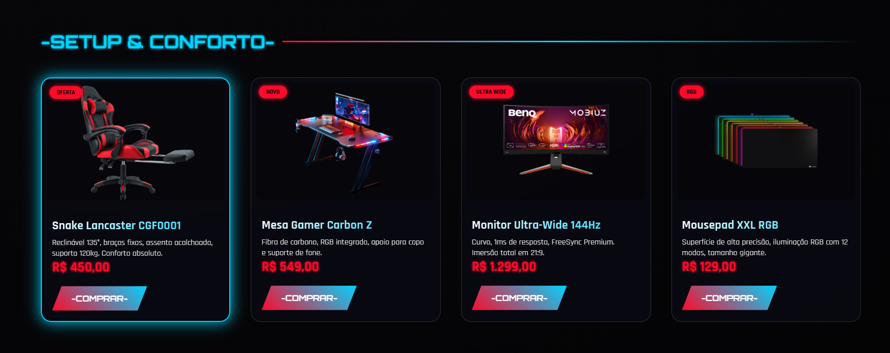
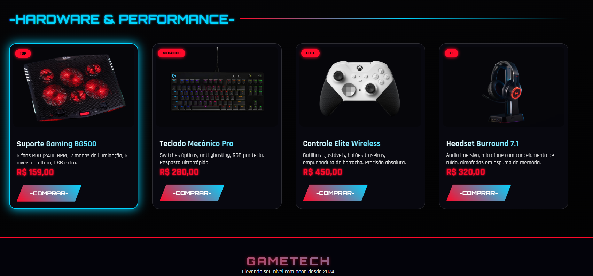

# GameTECH – Landing Page Neon Gaming Store


Uma landing page premium para uma loja gamer, desenvolvida com visual neon futurista (vermelho e azul), vídeo de fundo no YouTube, cards de produtos com efeitos de destaque e seções organizadas para promover três itens estratégicos: o jogo **ARK 2** (lançamento), a **Cadeira Snake Lancaster** (baixa procura) e o **Suporte Gaming BG500** (alto estoque). Projeto acadêmico para a disciplina de Desenvolvimento Web, focado em estratégias de marketing digital e análise de concorrentes (Nuuvem e Green Man Gaming).

---

## Screenshots

- **Hero Section com vídeo do YouTube**  
  

- **Super Ofertas da Semana**  
  

- **Seção Games**  
  

- **Seção Setup & Conforto**  
  

- **Seção Hardware & Performance**  
  

## Sobre o Projeto

O projeto GameTECH consiste em uma landing page de vendas para uma loja de produtos gamers. A página é dividida em quatro seções principais:

1. **Hero** – com vídeo de fundo do YouTube (ARK Survivor II) e chamada para ação.
2. **Super Ofertas da Semana** – grade com os três produtos prioritários (ARK 2, Cadeira Snake, Suporte BG500), usando técnicas de **escassez** (pré-venda), **urgência** (preço riscado) e **prova social** (selo “alto estoque”).
3. **Games** – catálogo de jogos.
4. **Setup & Conforto** – cadeiras, mesas, monitores.
5. **Hardware & Performance** – acessórios como suporte para notebook, teclados, controles, headsets.

A identidade visual utiliza **neon vermelho** (`#ff0a2a`) e **azul ciano** (`#00d4ff`), com fundo gradiente escuro, cards com efeito glassmorphism e animação de pulsação nos cards em destaque. O layout é totalmente responsivo e prioriza a conversão, destacando os produtos que exigem estratégias especiais conforme enunciado da atividade.

---

## Tecnologias Utilizadas

- **HTML5** – estrutura semântica, seções (`<section>`), cards, menu fixo.
- **CSS3** –  
  - Variáveis customizadas (cores neon, glass blur).  
  - Grid Layout e Flexbox para organização dos cards.  
  - Animações (`@keyframes`) para pulsação neon (`neonPulse`).  
  - Efeito glassmorphism (`backdrop-filter`, `background: rgba`).  
  - Vídeo de fundo com iframe do YouTube (`position: absolute` + `transform`).  

---

## Funcionalidades

- **Menu fixo** com links âncora para as seções (`#ofertas`, `#games`, `#utilidades`, `#acessorios`).
- **Vídeo de fundo automático** (YouTube) em loop, mudo, sem controles – aumenta a imersão.
- **Cards organizados em grade** com hover que eleva o card e adiciona sombra neon azul.
- **Três cards em destaque** (classe `.card-destaque`) com animação de pulsação alternando entre vermelho e azul.
- **Badges personalizadas** para cada produto (LANÇAMENTO, OFERTA IMPERDÍVEL, TOP VENDAS, etc.).
- **Preços com parcelamento** e, no caso da cadeira, exibição do preço antigo riscado.
- **Botões CTA** com gradiente neon, clip-path assimétrico e efeito hover com aumento de brilho.

---

## Detalhes Visuais

O projeto utiliza uma paleta de cores **vermelho + azul neon** para transmitir energia, tecnologia e foco no público gamer.

- **Fundo geral**: gradiente radial (`#0a0a0f` para `#010101`).
- **Cards**: fundo semi-transparente (`rgba(10,10,20,0.7)`) com desfoque de 8px.
- **Bordas dos cards**: inicialmente sutis, ao hover ganham cor `#00d4ff` e sombra.
- **Cards em destaque**: borda dupla com animação `neonPulse` (alterna entre vermelho e azul a cada 1,5s).
- **Botões**: gradiente linear (45deg) de vermelho para azul, clip-path em polígono para um corte angular, e ao hover: `transform: translateY(-3px)`, aumento do box-shadow e espaçamento entre letras.
- **Vídeo de fundo**: escurecido com `backdrop-filter: brightness(0.85)` e overlay semi-transparente para garantir legibilidade do texto.
- **Scrollbar personalizada** com cor vermelha neon.

---

## Como Executar

1. **Clone o repositório** (ou faça o download do arquivo `.html`):
   ```bash
   git clone https://github.com/FaculdadeJV/Landing_e-comerce.git

---

## Autor
- Jonathan Arsego Lêla
- RA: 22408629
- Engenharia da Computação - CEUB
